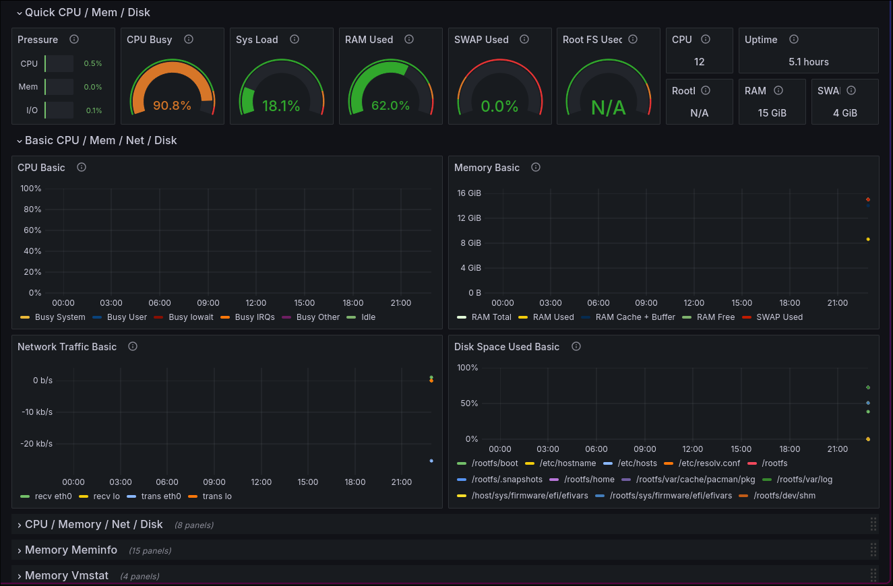

# Monitoring & Observability Case

This project is a simple example of monitoring and observability using Prometheus and Grafana.

## Table of contents

- [Prerequisites](#prerequisites)
- [Getting Started](#getting-started)
    - [Using prometheus as a data source in Grafana](#using-prometheus-as-a-data-source-in-grafana)
    - [Importing the dashboard](#importing-the-dashboard)

## Prerequisites

- Docker
- Docker Compose

## Getting Started

To start the project, run the following command in the root directory:

```bash
docker-compose up -d
```

| Service | URL | Credentials |
| ------- | --- | ----------- |
| Prometheus | [http://localhost:9090](http://localhost:9090) | - |
| Grafana | [http://localhost:3000](http://localhost:3000) | User: `admin`<br>Password: `admin` |
| Prometheus Node Exporter | [http://localhost:9100](http://localhost:9100) | - |

---

### Using prometheus as a data source in Grafana

To use Prometheus as a data source in Grafana, follow the steps below:

1. Click on the `Connections` from the left menu.
2. Search for the `Prometheus` and click on it.
3. Click on the `Add new data source` button.
4. Fill the URL field with `http://prometheus:9090`.
5. Click on the `Save & Test` button. If everything is correct, you will see a success message.

### Importing the dashboard

To import the dashboard, follow the steps below:

1. Click on the `Dashboards` from the left menu.
2. Click on the `New` button and then `Import`.
3. Copy the content of the [rfmoz/grafana-dashboards/node-exporter-full.json](./grafana/node-exporter-full.json) file and paste it in the `Import via dashboard JSON model` field and click on the `Load` button.
4. Select the Prometheus data source and click on the `Import` button.

After following the steps above, you will see the dashboard with the metrics.



## License

This project is licensed under the Apache License 2.0 - see the [LICENSE](./LICENSE) file for details.
